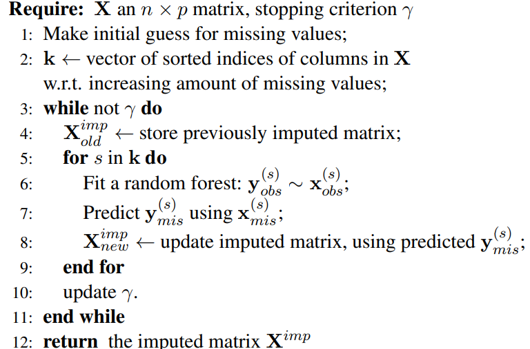
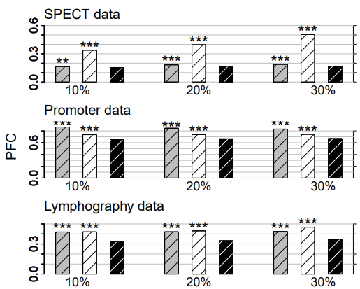
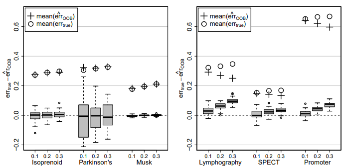
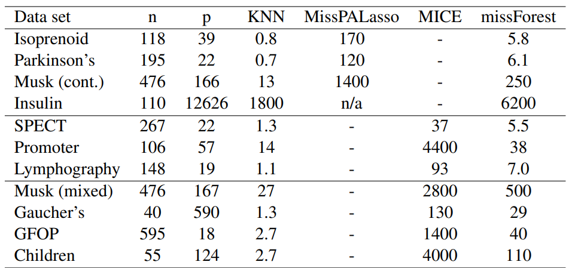
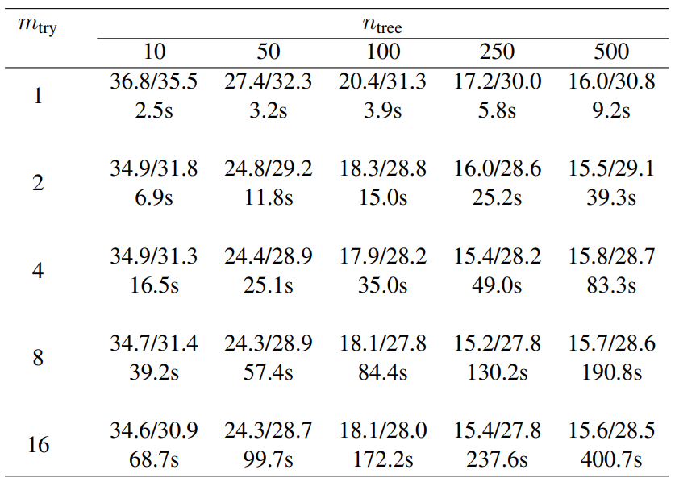

# MissForest

[](https://doi.org/10.5281/zenodo.13368883)

[](https://opensource.org/licenses/mit-license.php)
[](https://badge.fury.io/py/MissForest)
[](https://github.com/ellerbrock/open-source-badges/)

This project is a Python implementation of the MissForest algorithm, a powerful 
tool designed to handle missing values in tabular datasets. The primary goal of 
this project is to provide users with a more accurate method of imputing 
missing data.

While MissForest may take more time to process datasets compared to simpler 
imputation methods, it typically yields more accurate results.

Please note that the efficiency of MissForest is a trade-off for its accuracy. 
It is designed for those who prioritize data accuracy over processing speed. 
This makes it an excellent choice for projects where the quality of data is 
paramount.

# How MissForest Handles Categorical Variables ?

Categorical variables in argument `categoricals` will be label encoded for
estimators to work properly. 

# Example

To install MissForest using pip.

```console
pip install MissForest
```

Imputing a dataset:

```python
import pandas as pd
import numpy as np
from sklearn.model_selection import train_test_split
from missforest import MissForest

# Load toy dataset.
df = pd.read_csv("insurance.csv")

# Label encoding.
df["sex"] = df["sex"].map({"male": 0, "female": 1})
df["region"] = df["region"].map({
    "southwest": 0, "southeast": 1, "northwest": 2, "northeast": 3})
df["smoker"] = df["smoker"].map({"yes": 0, "no": 1})

# Create missing values.
for c in df.columns:
    n = int(len(df) * 0.1)
    rand_idx = np.random.choice(df.index, n)
    df.loc[rand_idx, c] = np.nan

# Split dataset into train and test sets.
train, test = train_test_split(df, test_size=.3, shuffle=True,
                               random_state=42)

# Default estimators are lgbm classifier and regressor
mf = MissForest(categorical=["sex", "smoker", "region"])
mf.fit(x=train)
train_imputed = mf.transform(x=train)
test_imputed = mf.transform(x=test)
```

Or using the `fit_transform` method
```python
mf = MissForest(categorical=["sex", "smoker", "region"])
train_imputed = mf.fit_transform(X=train)
test_imputed = mf.transform(X=test)
print(test_imputed)
```

# Imputing with other estimators

```python
from missforest import MissForest
import pandas as pd
import numpy as np
from sklearn.ensemble import RandomForestRegressor, RandomForestClassifier

df = pd.read_csv("insurance.csv")

for c in df.columns:
    random_index = np.random.choice(df.index, size=100)
    df.loc[random_index, c] = np.nan

clf = RandomForestClassifier(n_jobs=-1)
rgr = RandomForestRegressor(n_jobs=-1)

mf = MissForest(clf, rgr)
df_imputed = mf.fit_transform(df)
```

# Pseudo Code


# Figures
Here are some figures and tables from **Stekhoven and Buhlmann (2012)**


Figure 1: Continuous data. Average NRMSE for KNNimpute (grey), MissPALasso (white) and missForest (black) on four different data sets and three different amounts of missing values, i.e., 10%, 20%
and 30%. Standard errors are in the order of magnitude of 10−4
. Significance levels for the paired
Wilcoxon tests in favour of missForest are encoded as “*” <0.05, “**” <0.01 and “***” <0.001. If the
average error of the compared method is smaller than that of missForest the significance level is encoded
by a hash (#) instead of an asterisk. In the lowermost data set results for MissPALasso are missing due
to the methods limited capability with regard to high dimensions.



Figure 2: Categorical data. Average PFC for cross-validated KNNimpute (grey), MICE (white) and
missForest (black) on three different data sets and three different amounts of missing values, i.e., 10%,
20% and 30%. Standard errors are in the order of magnitude of 10−4
. Significance levels for the paired
Wilcoxon tests in favour of missForest are encoded as “*” <0.05, “**” <0.01 and “***” <0.001.


Figure 3: Mixed-type data. Average NRMSE (left bar) and PFC (right bar, shaded) for KNNimpute
(grey), MICE (white) and missForest (black) on four different data sets and three different amounts
of missing values, i.e., 10%, 20% and 30%. Standard errors are in the order of magnitude of 10−3
.
Significance levels for the paired Wilcoxon tests in favour of missForest are encoded as “*” <0.05, “**”
<0.01 and “***” <0.001. If the average error of the compared method is smaller than that of missForest
the significance level is encoded by a hash (#) instead of an asterisk. Note that, due to ill-distribution
and near dependence in the Child hospital data, the results for MICE have to be treated with caution (see
Section 4.3).




Figure 4: Difference of true imputation error errtrue and OOB imputation error estimate err cOOB for the
continuous data sets (left) and the categorical data sets (right) and three different amounts of missing
values, i.e., 0.1, 0.2 and 0.3. In each case the average errtrue (circle) and the average err cOOB (plus) over
all simulations is given.




Table 1: Average runtimes [s] for imputing the analyzed data sets. Runtimes are averaged over the
amount of missing values since this has a negligible effect on computing time.




Table 2: Average imputation error (NRMSE/PFC in percent) and runtime (in seconds) with different
numbers of trees (ntree) grown in each forest and variables tried (mtry) at each node of the trees. Here,
we consider the GFOP data set with artificially introduced 10% of missing values. For each comparison 50 simulation runs were performed using always the same missing value matrix for all numbers of
trees/randomly selected variables for a single simulation.
